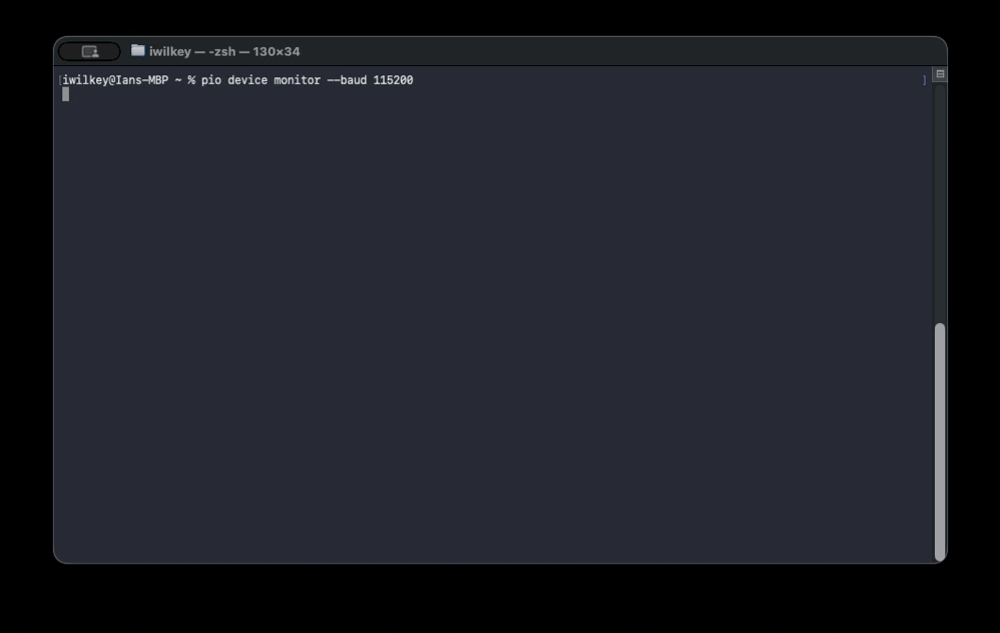
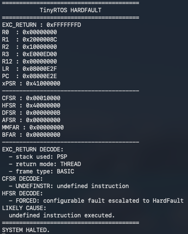

# tinyrtos

A compact, preemptive priority RTOS kernel for ARM Cortex-M, written completely from scratch in C.

**tinyrtos** is a small Cortex-M-focused RTOS designed around deterministic behavior, static allocation, readability, and low overhead. The project began as a deep dive into RTOS internals and has evolved into an effort to build a genuinely practical embedded kernel while preserving architectural simplicity and a very small footprint.

Unlike large RTOS ecosystems focused on portability and extensive middleware integration, tinyrtos intentionally stays close to the hardware and exposes the underlying execution model directly.

<p align="center">
  
</p>

<p align="center">
  TinyRTOS running on an STM32 Nucleo-F756ZG demonstrating the built-in OSI runtime shell.
</p>

---

## Current Status

**tinyrtos** currently supports:

* Preemptive priority scheduling
* Round-robin scheduling within equal priorities
* PendSV context switching
* SVC-based task startup
* Separate PSP task stacks
* Blocking and sleeping tasks
* Counting semaphores
* Mutexes
* Queues
* ISR-safe synchronization APIs
* Stack watermarking
* HardFault register dump diagnostics
* Runtime task diagnostics through the OSI
* STM32F756ZG board support package

The kernel currently targets STM32F7 Cortex-M7 hardware and is built/tested using PlatformIO and GCC ARM.

This project is not yet production-ready, but it is intentionally moving in that direction.

The long-term design philosophy is:

* deterministic behavior
* small memory footprint
* static allocation where possible
* understandable architecture
* practical embedded usability
* minimal abstraction overhead

---

## Footprint

Measured on STM32 Nucleo-F756ZG using the GCC ARM compilation of the simple `nucleo_f756zg_osi` example.

| Build Flags | Flash Size (Bytes) | Description |
|:---:|:---:|:---:|
| `-O0` | 12,044 | Debug, no optimization |
| `-Og` | 9,780 | Debug-friendly optimization |
| `-O1` | 9,708 | Light optimization |
| `-O2` | 9,772 | General optimization |
| `-Os` | 9,164 | Size optimization |

**NOTE:** Full-kernel LTO: not currently supported due to naked assembly references across translation units. Fix planned.

---

## Design Goals

**tinyrtos** is intentionally designed around a smaller and more deterministic execution model than larger RTOS ecosystems.

The kernel currently uses:

* statically allocated tasks
* bounded scheduler structures
* no dynamic heap allocation
* direct Cortex-M exception usage
* explicit synchronization primitives

This keeps the architecture relatively small and easy to reason about while still supporting real preemptive multitasking behavior.

The goal is not to compete directly with FreeRTOS, Zephyr, ThreadX, or other mature RTOS ecosystems. Those systems are significantly more portable, feature-rich, and battle-tested.

Instead, tinyrtos aims to provide:

* a readable RTOS implementation
* a strong educational/reference kernel
* a lightweight embedded execution environment
* a foundation for experimentation and continued RTOS development

---

## Repository Structure

```text
include/tinyrtos/
  bsp/
  kernel/
  osi/
src/
  f756zg/
  kernel/
  osi/
examples/
  nucleo_f756zg_osi/
```

The reusable RTOS library lives under `include/` and `src/`.

Example firmware projects are provided separately under `examples/`.

---

## Building The Example

The primary example project is located at:

```text
examples/nucleo_f756zg_osi
```

Requirements:

* VSCode
* PlatformIO
* STM32 Nucleo-F756ZG

Build and flash:

```bash
cd examples/nucleo_f756zg_osi
pio run -t upload
```

Open a serial monitor:

```bash
pio device monitor -b 115200
```

You should see the TinyRTOS OSI boot banner.

---

## Using tinyrtos

Now published to the PlatformIO registry, **tinyrtos** can be added to your project through `lib_deps`.

Example `platformio.ini`:

```ini
[env:nucleo_f756zg]
platform = ststm32
board = nucleo_f756zg
framework = cmsis
upload_protocol = stlink
monitor_speed = 115200

lib_deps =
    iwilkey/tinyrtos
```

For boards other than the Nucleo-F756ZG, you will need to provide or implement a board support package for your target hardware.

## Public API

Example task creation:

```c
#include <tinyrtos/kernel/kernel.h>

static void led_task(void) {
    while(1) {
        rtosk_kernel_sleep_ms(1000UL);
    }
}

int main(void) {
    rtosk_kernel_systick_init();
    rtosk_kernel_create_task(led_task, 1UL, "led");
    rtosk_kernel_start();

    for(;;) {}
}
```

Core kernel API:

```c
void rtosk_kernel_systick_init(void);
void rtosk_kernel_create_task(rtosk_task_func_t task_func, uint32_t priority, const char * name);
void rtosk_kernel_start(void);
void rtosk_kernel_sleep_ms(uint32_t ms);
void rtosk_kernel_yield(void);
uint32_t rtosk_kernel_get_ticks(void);
```

Synchronization:

```c
void rtosk_semaphore_init(rtosk_semaphore_t * sem, uint32_t initial_count);
void rtosk_semaphore_take(rtosk_semaphore_t * sem);
void rtosk_semaphore_give(rtosk_semaphore_t * sem);
void rtosk_semaphore_give_from_isr(rtosk_semaphore_t * sem);

void rtosk_mutex_init(rtosk_mutex_t * mutex);
void rtosk_mutex_lock(rtosk_mutex_t * mutex);
void rtosk_mutex_unlock(rtosk_mutex_t * mutex);
```

Queues:

```c
void rtosk_queue_init(rtosk_queue_t * queue, void * buffer, uint32_t item_size, uint32_t capacity);
uint32_t rtosk_queue_send(rtosk_queue_t * queue, const void * item);
uint32_t rtosk_queue_send_from_isr(rtosk_queue_t * queue, const void * item);
uint32_t rtosk_queue_receive(rtosk_queue_t * queue, void * item);
```

Public headers are exposed under:

```c
#include <tinyrtos/kernel/kernel.h>
#include <tinyrtos/kernel/queue.h>
#include <tinyrtos/kernel/mutex.h>
#include <tinyrtos/kernel/semaphore.h>
#include <tinyrtos/osi/osi.h>
```

---

## OSI (Operating System Interface)

tinyrtos includes a lightweight UART runtime shell called the OSI.

The OSI currently provides:

```text
help
about
freq
uptime
ticks
tasks
fault
reboot
```

The OSI is intended to evolve into the primary runtime diagnostics and debugging interface for the kernel.

<p align="center">
  
</p>

---

## Current Limitations

tinyrtos intentionally remains relatively small and focused.

The kernel does not yet implement:

* priority inheritance
* dynamic task allocation/deletion
* stack overflow trapping
* MPU isolation
* tickless idle
* software timers
* event groups
* SMP/multicore support
* networking/filesystems

Applications are currently expected to:

* avoid deadlock by design
* acquire resources consistently
* avoid unbounded priority inversion

These are known limitations and active areas of future development.

---

## Planned Direction

Current areas of interest include:

* priority inheritance
* improved scheduler diagnostics
* event groups
* software timers
* stronger fault diagnostics
* better BSP abstraction
* additional Cortex-M targets
* performance benchmarking
* lightweight GUI/framebuffer experimentation

The long-term goal is to continue evolving tinyrtos toward a genuinely practical embedded RTOS while preserving readability, determinism, and low overhead.

---

## Contributing

Contributions, critiques, architectural discussions, and pull requests are all welcome.

If contributing code:

* keep APIs small and explicit
* prefer deterministic/static behavior
* avoid unnecessary abstraction layers
* preserve readability where possible
* document architectural tradeoffs clearly

Discussion around RTOS internals, Cortex-M exception handling, synchronization design, scheduling behavior, and embedded systems architecture is strongly encouraged.

---

## License

**tinyrtos** is released under the MIT license.

It may be freely used for:

* education
* experimentation
* embedded firmware development
* commercial applications

subject to the limitations described above.
